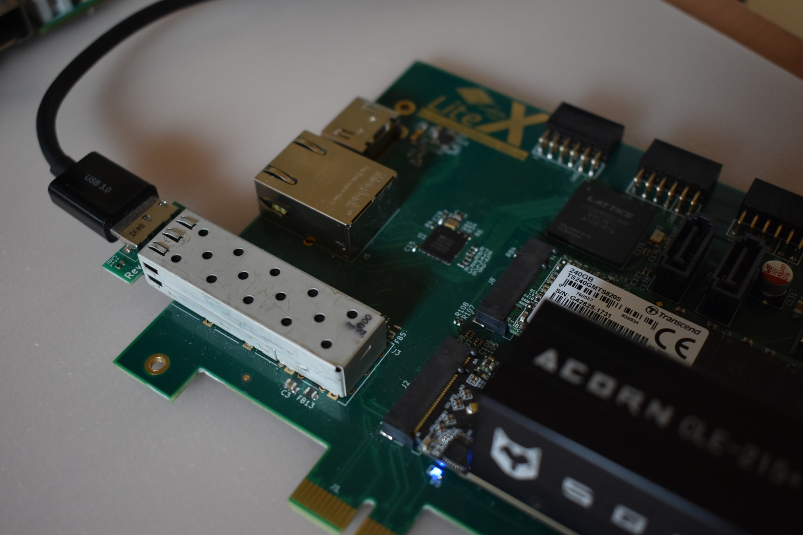
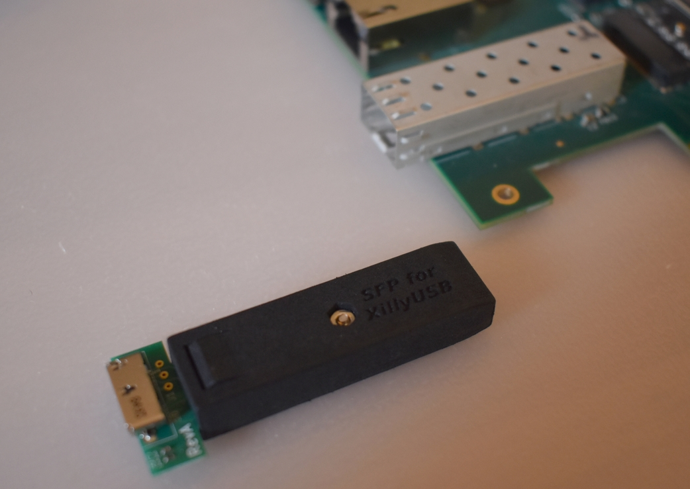
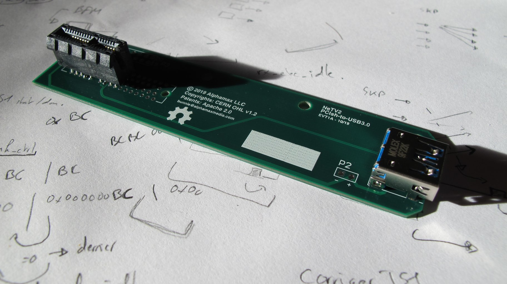
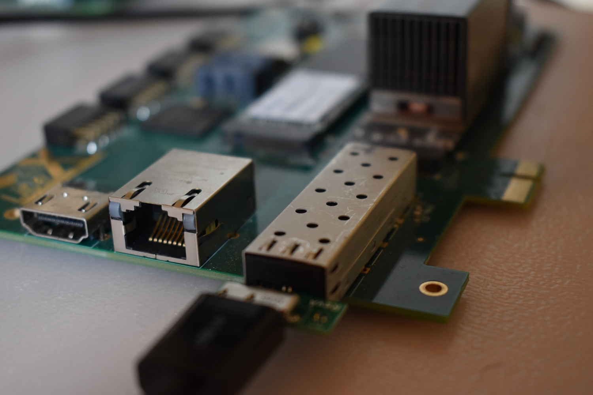

```
                         __  _________  ____    ___  _______  ____
                        / / / / __/ _ )|_  /___/ _ \/  _/ _ \/ __/
                       / /_/ /\ \/ _  |/_ <___/ ___// // ___/ _/
                       \____/___/____/____/  /_/  /___/_/  /___/
                             Copyright (c) 2019-2022, EnjoyDigital
                                      Powered by LiteX
```
[](https://travis-ci.com/enjoy-digital/usb3_pipe)


[> Intro
--------



The aim of this project is to experiment with [High Speed Transceivers (SERDES)](https://en.wikipedia.org/wiki/Multi-gigabit_transceiver) of popular FPGAs to create a [USB3.0 PIPE interface](https://www.intel.com/content/dam/www/public/us/en/documents/white-papers/phy-interface-pci-express-sata-usb30-architectures-3.1.pdf).

Current solutions for USB3 connectivity with an FPGA require the use of an external SerDes chip ([TI TUSB1310A - SuperSpeed 5 Gbps USB 3.0 Transceiver with PIPE and ULPI Interfaces](http://www.ti.com/product/TUSB1310A)) or external FIFO chip ([FTDI FT60X](https://www.ftdichip.com/Products/ICs/FT600.html) or Cypress [FX3](https://www.cypress.com/products/ez-usb-fx3-superspeed-usb-30-peripheral-controller)). With this project, we want to see if it's possible to just use the transceivers of the FPGA for the USB3 connectivity and have the USB3 PIPE directly implemented in the fabric (and then avoid any external chip!)

[> Targets
----------
While we hope this wrapper will eventually support multiple protocols through the PIPE interface (such as PCIe, SATA, DisplayPort) it is currently targeting support for [USB3.0 SuperSpeed](https://en.wikipedia.org/wiki/USB_3.0#Data_encoding) when used with a customized [Daisho USB3 core](https://github.com/enjoy-digital/daisho).

It currently targets Xilinx Kintex7 and Artix7.

[> Test Hardware
----------------
One of the following boards:
 - [KC705](https://www.xilinx.com/products/boards-and-kits/ek-k7-kc705-g.html)
 - [LiteX Acorn Baseboard](https://github.com/enjoy-digital/litex-acorn-baseboard)

paired with the [SFP2USB](http://xillybus.com/sfp2usb-module) borrowed from [XillyUSB](http://xillybus.com/xillyusb) project:



 or with the [SFP2USBPCIsh-to-USB3.0](https://github.com/enjoy-digital/usb3_pipe/blob/master/doc/breakout_board.pdf) breakout board:



 **Note:** Any 7-Series board with a SFP or PCIe connector with also be suitable but will require creating a platform/target file if not already supported in [LiteX-Boards](https://github.com/litex-hub/litex-boards).

[> Toolchain
------------
This project targets Xilinx Vivado for Kintex7 / Artix7 support. In the future, it should also be possible to use [F4PGA](https://f4pga.org/) toolchains to build the design.


[> Prerequisites
----------------
```sh
$ sudo apt install build-essential wget git python3-setuptools
$ git clone ttps://github.com/enjoy-digital/usb3_pipe/
$ cd usb3_pipe
```

[> Installing LiteX
-------------------
Follow LiteX installation [guide](https://github.com/enjoy-digital/litex/wiki/Installation).

[> Installing Verilator
-----------------------
```sh
$ sudo apt install verilator
$ sudo apt install libevent-dev libjson-c-dev
```

[> Running the LiteX simulation
-------------------------------
```sh
$ ./sim.py
```
You should see the USB3.0 initialization between a Host and Device:
```
[00000000] HOST entering Polling.LFPS state
[00000000] DEV  entering Polling.LFPS state
[00000000] HOST entering Polling.LFPS state
[00000000] DEV  entering Polling.LFPS state
[00026641] HOST entering Polling.RxEQ state
[00026641] DEV  entering Polling.RxEQ state
[01075207] HOST entering Polling.Active state
[01075207] DEV  entering Polling.Active state
[01075296] HOST entering Polling.Configuration state
[01075296] DEV  entering Polling.Configuration state
[01075423] HOST entering Polling.Idle state
[01075423] DEV  entering Polling.Idle state
```

At this point, all the steps of the USB3.0 PIPE initialization have succeeded and the USB3.0 Core can start transmitting packets.

To have a .vcd waveform of the simulation, run it with --trace:
```sh
$ ./sim.py --trace
$ gtkwave build/gateware/dut.vcd
```

[> Running on hardware
----------------------
### Build the FPGA bitstream
Once installed, build the bitstream with:
```sh
$ ./target.py --build (can be kc705 or acorn)
```

### Prepare the hardware:

- Put the SFP2USB module into the SFP cage of the board.
- Connect the USB3.0 cable between the SFP2USB module and the computer.
- Connect the JTAG programming cable to the FPGA board.
- Power on the hardware

### Load the FPGA bitstream
To load the bitstream to you board, run:
```sh
$ ./target.py --load
```

### Verify USB3.0 link establishment
Once the FPGA is loaded, the link will be automatically established with the computer and an Openmoko, Inc USB3.0 device should be enumerated.

**Note:** Enumeration has only been done on a few hardware setups and there is still work in progress to improve reliability.